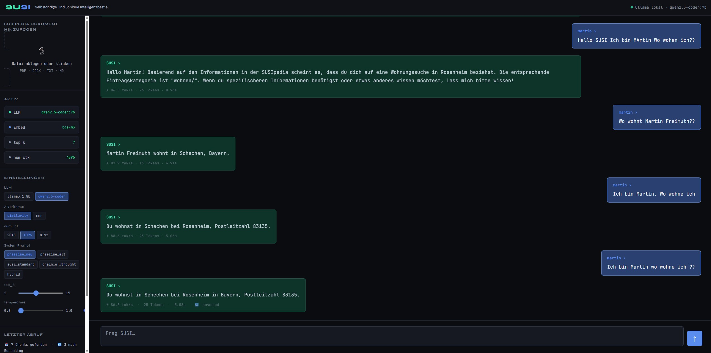

# SUSI – Selbständige und Schlaue Intelligenzbestie

> Vollständig lokaler, DSGVO-konformer KI-Assistent mit RAG-Wissensbasis.  
> Kein einziges Byte verlässt den lokalen Rechner.


---

## Was ist SUSI?

SUSI ist ein persönlicher KI-Assistent der komplett lokal läuft — keine Cloud, keine externen APIs, keine Datenweitergabe. Die Wissensbasis heißt **SUSIpedia**: eine wachsende Sammlung von Markdown-Dateien die Martins Projekte, Lernnotizen, Code-Kontext und persönliche Informationen enthält.

Das System kombiniert **Retrieval-Augmented Generation (RAG)** mit lokalen LLMs über Ollama. SUSIpedia ist der eigentliche Kern — das System ist modell-agnostisch und funktioniert mit jedem Ollama-Modell.

---

## Query Rewriting in Action



Der Screenshot zeigt die Entwicklung der Antwortqualität durch Query Rewriting und SUSIpedia-Optimierung:

| Frage | Ergebnis | Tokens |
|---|---|---|
| "Hallo SUSI Ich bin Martin Wo wohne ich??" | ❌ Falsch — verweist auf Wohnungssuche-Kategorie | 76 |
| "Wo wohnt Martin Freimuth??" | ✅ Richtig — 3. Person direkt | 13 |
| "Ich bin Martin. Wo wohne ich" | ✅ Richtig — dank `ich_bin_martin.md` | 23 |
| "Ich bin Martin wo wohne ich ??" | ✅ Richtig — Query Rewriting + Reranker | 25 |

**Erkenntnis:** Query Rewriting schreibt Ich-Form Fragen automatisch in optimale Suchanfragen um. Kürzere Antworten, höhere Präzision, korrekte Profil-Auswahl durch den Router.

---

## Tech Stack

| Komponente | Technologie |
|---|---|
| Backend | Django |
| Frontend | HTMX |
| LLM (primär) | Ollama – `qwen2.5-coder:7b` |
| LLM (sekundär) | Ollama – `llama3.1:8b` |
| Embeddings | `BAAI/bge-m3` |
| Reranker | `BAAI/bge-reranker-v2-m3` |
| Vector Store | ChromaDB (lokal) |
| Orchestrierung | LangChain (Retrieval + Chunking) |
| Wissensbasis | SUSIpedia – 41+ Markdown Files, 617 Chunks |
| Konfiguration | `susi_config.yaml` – Single Source of Truth |

**Hardware:** AMD Ryzen 9 5900X · 32 GB RAM · RTX 4070 12 GB VRAM

---

## Projektstruktur

```
SUSI/
├── docs/                        ← SUSIpedia Wissensbasis
│   ├── susi/                    ← SUSI selbst (Architektur, Vision, Evaluation)
│   ├── coding/                  ← Projekte: GMM, StockPredict, HouseOfStocks, Portfolio
│   ├── lernen/                  ← AI, ML, RAG, Python, HTMX, DevOps, ...
│   ├── projekte/                ← Projektdokumentation, Roadmaps
│   ├── job/                     ← Jobsuche, Bewerbungen, CV, LinkedIn
│   ├── martin/                  ← Persönliches Profil, Werte, Ziele
│   ├── technik/                 ← Hardware, Tools, Setup
│   ├── familie/                 ← Familiäre Kontexte
│   └── hobbys/                  ← Interessen, Freizeit
├── rag/
│   ├── ingest.py                ← Markdown → ChromaDB (Upsert mit MD5-Hash)
│   ├── query.py                 ← Query Rewriting → Retrieval → Reranker → Router → LLM → Antwort
│   ├── router.py                ← Retrieval-getriebener Profil-Router
│   └── susi_config.yaml         ← Alle Parameter zentral (inkl. Router-Profile)
├── core/                        ← Django App (Views, URLs, Templates)
├── susi_project/                ← Django Settings
├── tools/
│   └── evaluation/              ← RAG Evaluation Framework
│       ├── grid_run.py          ← Grid Search über alle Parameterkombinationen
│       ├── evaluator.py         ← BERTScore + ROUGE-L Metriken
│       ├── auto_scorer.py       ← Automatische Bewertung (0–3 Skala)
│       ├── retrieval_check.py   ← Hit Rate Messung
│       ├── eval_meta.py         ← Metadaten pro Run
│       ├── analyse_csv.py       ← Ergebnisanalyse
│       └── results/             ← CSV Ergebnisse
├── chroma_db/                   ← Lokale Vektordatenbank
└── manage.py
```

---

## Setup & Start

### 1. Repository klonen
```powershell
git clone https://github.com/Martin-Frei/SUSI_neu.git
cd SUSI_neu
```

### 2. venv erstellen und aktivieren
```powershell
python -m venv susi_env
susi_env\Scripts\activate
pip install -r requirements.txt
```

### 3. Ollama Modelle laden
```powershell
ollama pull qwen2.5-coder:7b
ollama pull llama3.1:8b
ollama pull bge-m3
```

### 4. Docs indexieren
```powershell
python rag/ingest.py
```

### 5. SUSI starten
```powershell
python manage.py runserver
```

### Alles neu indexieren (Reset)
```powershell
Remove-Item -Recurse -Force chroma_db\
python rag/ingest.py
```

---

## Wie die RAG-Pipeline funktioniert

```
Frage eingeben
     ↓
Query Rewriting — LLM schreibt Frage in optimale Suchanfrage um
("Ich bin Martin. Wo wohne ich?" → "Wo wohnt Martin Freimuth?")
     ↓
Embedding (bge-m3) → ChromaDB: Top-k ähnliche Chunks (similarity oder MMR)
     ↓
bge-reranker-v2-m3: Chunks neu sortieren → Top-n behalten
     ↓
Router: Ordnerpfad der Top-Chunks bestimmt Profil (LLM + Parameter)
     ↓
Chunks + Original-Frage + System Prompt → Ollama LLM
     ↓
Antwort + Quellen + tok/s Metriken → Django/HTMX Frontend
```

---

## Retrieval-getriebener Router

Das Herzstück von SUSI: Nicht Keyword-Matching sondern die **SUSIpedia-Ordnerstruktur selbst** bestimmt welches LLM und welche Parameter genutzt werden.

```python
# Beispiel Voting:
# Chunk 1 (score=0.92) aus coding/  → projekte: 0.92
# Chunk 2 (score=0.71) aus lernen/  → lernen:   0.71
# Chunk 3 (score=0.68) aus lernen/  → lernen:  +0.68 = 1.39  ← Gewinner
```

| Profil | LLM | top_k | Einsatz |
|---|---|---|---|
| susi | qwen2.5-coder:7b | 7 | SUSI-Selbstwissen |
| projekte | qwen2.5-coder:7b | 7 | Code-Projekte |
| lernen | llama3.1:8b | 9 | Lernmaterial, Konzepte |
| persoenlich | qwen2.5-coder:7b | 5 | Persönliches, Job |
| technik | qwen2.5-coder:7b | 5 | Hardware, Tools |

Profile sind in `susi_config.yaml` definiert und enthalten bereits einen `thinking`-Flag für kommende qwen3-Modelle.

---

## SUSIpedia – Philosophie

```
Eine .md Datei    = Ein klar abgegrenztes Thema
Ein ## Abschnitt  = Wird zu eigenem ChromaDB-Chunk
Max 3 Ebenen      = Lebensbereich → Projekt → Aspekt
```

**Wichtigste Regel:** Immer vollständige Sätze statt kompakter Listen.  
Kompakte Listen retrieven schlecht — der erste Satz jedes `##` Abschnitts  
muss den vollständigen Kontext enthalten damit der Chunk ohne das restliche  
Dokument verständlich ist.

```
❌  contamination=0.05, n_estimators=100
✅  Der Isolation Forest verwendet eine Contamination von 0.05
    was einer erwarteten Anomalierate von 5 Prozent entspricht.
```

---

## Evaluation Framework

SUSI hat ein vollständiges RAG-Evaluierungs-Framework unter `tools/evaluation/`:

```powershell
# Smoke Test (4 Fragen, schnell)
python tools/evaluation/grid_run.py --mode smoke --config tools/evaluation/eval_config_lauf_C.yaml

# Full Run (293 Fragen, über Nacht)
python tools/evaluation/grid_run.py --mode full --config tools/evaluation/eval_config_lauf_C.yaml

# Dry Run (nur Kombinationen anzeigen)
python tools/evaluation/grid_run.py --dry-run --mode full --config tools/evaluation/eval_config_lauf_C.yaml
```

### Ergebnisse Lauf C (Juni 2026)

**5.860 automatisierte Runs · 293 Fragen · 20 Parameterkombinationen**

| Konfiguration | Ø Score | Korrekt |
|---|---|---|
| k=3, ohne Reranker | 2.97 / 3.0 | 98% |
| k=7, mit Reranker | 3.01 / 3.0 | **100%** |
| qwen2.5-coder:7b | 3.02 / 3.0 | 100% |
| llama3.1:8b | 2.98 / 3.0 | 99% |

**Reranker-Vergleich:**

| Reranker | Korrektheit |
|---|---|
| amberoad/bert-multilingual | 59% ❌ |
| **BAAI/bge-reranker-v2-m3** | **97%** ✅ |

**Wichtigste Erkenntnis:** Die größte Qualitätsverbesserung kam nicht durch Modell-Tuning  
sondern durch bessere Dokumentstruktur — Hit Rate von 36% auf 91% allein durch  
SUSIpedia-Formatierung und Chunk-Size-Erhöhung (300 → 1000 Tokens).

---

## Roadmap

### Stufe 1 – Coding Assistent (aktiv ✅)
Lokaler RAG mit Ollama + ChromaDB + LangChain + Django/HTMX.  
Vollständiges Evaluation Framework. Multilingualer Reranker. Query Rewriting.

### Stufe 2 – Retrieval-getriebener Router (fertig ✅)
Dynamische Profil-Auswahl basierend auf den retrievten SUSIpedia-Ordnern.  
Die Wissensbasis-Struktur bestimmt LLM, top_k und Parameter — kein Keyword-Matching.  
`thinking`-Flag vorbereitet für qwen3-Modelle.

### Stufe 3 – Physischer Assistent (geplant)
Arduino + Raspberry Pi · Sensoren · Smart Home via Home Assistant.

### Stufe 4 – Persönlicher Lebensassistent (Vision)
Vollständiges Second Brain · LangChain Agents · eigenständiges Handeln.

---

## Sicherheit & Datenschutz

- Läuft vollständig lokal, keine Cloud-Abhängigkeiten
- Festplatte verschlüsselt via BitLocker
- Keine Telemetrie, keine externen API-Calls
- Lokale Fonts (keine Google Fonts), kein externer Request

---

## Verwandte Projekte

| Projekt | Beschreibung |
|---|---|
| **StockPredict V2** | LSTM + XGBoost Aktienvorhersage, deployed auf Railway |
| **Global Market Mood (GMM)** | Sentiment-Analyse globaler Finanznachrichten (160+ RSS Feeds) |
| **HouseOfStocks** | Portfolio-Dashboard mit Django + Supabase |
| **SAP Fraud Detection** | Anomalie-Erkennung für SAP Sales Orders + Email Verification |

---

## 🇬🇧 English Summary

SUSI is a fully local RAG assistant — no cloud, no external APIs, no data leaving the machine.

**Stack:** Python · Django · HTMX · ChromaDB · Ollama · bge-m3 · bge-reranker-v2-m3 · qwen2.5-coder:7b

**Key results from Evaluation Run C (5,860 automated runs):**
- 98–100% answer correctness across 293 questions
- Biggest improvement: document quality (Hit Rate 36% → 91%), not model tuning
- Wrong reranker actively harmful: amberoad 59% vs bge-reranker-v2-m3 97%

**Architecture:** Query Rewriting → Retrieval (bge-m3) → Reranker (bge-reranker-v2-m3) → Retrieval-driven Router → LLM (qwen2.5-coder:7b / llama3.1:8b)

---

*Entwickler: Martin Freimuth · [github.com/Martin-Frei](https://github.com/Martin-Frei) · [martin-freimuth.dev](https://martin-freimuth.dev) · Stand: Juni 2026*