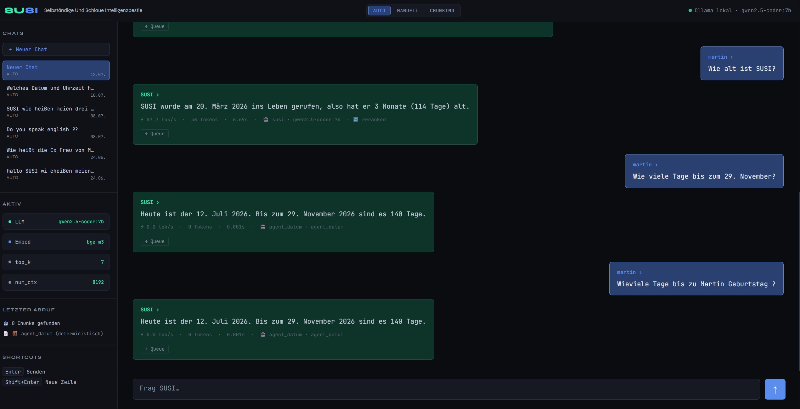

# SUSI — Selbständige und Schlaue Intelligenzbestie

> Fully local, GDPR-compliant AI assistant with RAG knowledge base.  
> Personal data never leaves the local machine.


**97% answer accuracy · 5,860 automated eval runs · Latency halved: 26s → ~12s · 0.001s deterministic instead of 8s LLM hallucination**

---

## What is SUSI?

SUSI is a personal AI assistant that runs entirely locally — no cloud, no data sharing. The knowledge base is called **SUSIpedia**: a growing collection of Markdown files containing projects, learning notes, and personal context.

The system combines **Retrieval-Augmented Generation (RAG)** with local LLMs via Ollama. SUSIpedia is the actual core — SUSI is model-agnostic and works with any Ollama model.

SUSI was born from a simple conviction: a personal assistant that knows everything about me doesn't belong in the cloud. That's why everything runs locally — the exciting engineering question is how much quality you can squeeze out of 7B models on consumer hardware. Answer: 97%.

**Only exception:** The Britannica integration (Stage 1.3) fetches curated encyclopedia articles via API — outgoing requests contain only the topic name, never personal data. The knowledge is indexed locally.

---

## SUSI in Action



Three questions, three different mechanisms:

| Question | Mechanism | Time | Answer |
|---|---|---|---|
| "How old is SUSI?" | Branch 2: Date from chunk, Python calculates | 6.69s | SUSI is 3 months (114 days) old ✅ |
| "How many days until November 29?" | Branch 1: Python datetime directly | **0.001s** | 140 days ✅ |
| "How many days until Martin's birthday?" | Branch 1: Birthday anchor, Python | **0.001s** | 140 days ✅ |

**What this means:** Date questions are no longer handed to the LLM — LLMs hallucinate structurally on arithmetic tasks. Python datetime is deterministic. The `agent_datum` intercepts these questions before the LLM can answer them incorrectly.

---

## Core Architecture

```
Question in
     ↓
Language Detection (langdetect, ~0.002s)
     ↓
agent_datum Guard ──── Calendar question? ────► Python datetime → Answer (~0.001s)
     │ no
     ▼
Rewriter Bypass ─── First question or >300 chars? ──► Query passed unchanged
     │ no
     ▼
Query Rewriting (Coreference resolution, last 2 Q/A)
     ↓
ChromaDB Retrieval (bge-m3, top-k chunks)
     ↓
bge-reranker-v2-m3 (Keep top-n, 3–5s on CPU)
     ↓
agent_britannica ── Score ≤ 0.5? ────► Britannica/Wikipedia fallback
     │ no
     ▼
agent_datum Branch 2 ── Duration question? ───► Date from chunk, Python calculates
     │ no                                      Fact injected into prompt
     ▼
Retrieval-driven Router
     ↓
LLM generates answer (qwen2.5-coder:7b / llama3.1:8b / qwen2.5:7b)
     ↓
Frontend (Django + HTMX, tok/s + source files)
```

### Speed Optimizations (July/August 2026)

| Phase | Before | After | Fix |
|---|---|---|---|
| Language Detection | 4–12s (LLM) | 0.002s | `langdetect` library instead of Ollama call |
| Query Rewriting | 5–9s (always) | 0s or 5–9s | Bypass on first question or >300 chars |
| Reranking | 100–130s | 3–5s | Removed duplicate warmup, CPU pinning, chunk split |
| **Total** | **~26–30s** | **~10–15s** | |

---

## Retrieval-Driven Router

The heart of SUSI: not keyword matching but the **SUSIpedia folder structure itself** determines which LLM and parameters are used.

```python
# Example voting (reranker-score-weighted):
# Chunk 1 (score=0.92) from docs/coding/  → projekte: 0.92
# Chunk 2 (score=0.71) from docs/lernen/  → lernen:   0.71
# Chunk 3 (score=0.68) from docs/lernen/  → lernen:  +0.68 = 1.39  ← Winner
```

| Profile | LLM | Purpose |
|---|---|---|
| susi | qwen2.5-coder:7b | SUSI self-knowledge |
| projekte | qwen2.5-coder:7b | Code projects |
| lernen | llama3.1:8b | Learning material, concepts |
| persoenlich | qwen2.5:7b | Personal, career |
| technik | qwen2.5-coder:7b | Hardware, tools |
| wissen | qwen2.5:7b | Britannica/Wikipedia knowledge base |

**Fallback** when max reranker score ≤ 0.5: profile `persoenlich` or `agent_britannica` fallback.

---

## Agent Architecture

SUSI uses deterministic agents that intercept questions before or after the RAG pipeline. Principle: if the answer is computable, no LLM is asked.

| Agent | Function | Latency |
|---|---|---|
| `agent_datum` | Calendar questions (Branch 1: direct, Branch 2: date from chunk) | ~0.001s |
| `agent_pedia` | Wikipedia integration, heading conversion | variable |
| `agent_britannica` | On-demand Britannica fetch when reranker score ≤ 0.5 | variable |

**Naming convention:** `agent_*.py` for all tools. Planned: `agent_rechner` (math), `agent_meta` (SUSI config queries), `agent_duplikat` (SUSIpedia duplicate detection).

---

## Evaluation Framework

SUSI has a complete RAG evaluation framework under `tools/evaluation/`:

**Four-stage pipeline:** Auto-Scorer (Diagnostic Scale 0–6) → ValueCheck (deterministic number/date verification) → RAGAS (grey zones) → Haiku Judge (remaining ambiguities)

### Results

| Run | Questions | Runs | Result | Highlight |
|---|---|---|---|---|
| Run D | 293 | 800 | **97.1% accuracy** | bge-reranker-v2-m3 vs. amberoad: 97% vs. 59% |
| Run E | 293 | 586 | 96.9% (qwen3:8b) | Thinking=on vs. off: 0.011 points difference |
| Run F | 293 | 293 | Bug found | Double rewriting cost 16 percentage points |

**Key findings:**
- The biggest quality improvement came not from model tuning but from better document structure — retrieval hit rate from **36% to 91%** through SUSIpedia formatting and chunk size optimization alone.
- Fine-tuning on SUSIpedia data is unsuitable: too few chunks, living knowledge base — RAG is architecturally superior because knowledge remains external, auditable, and updatable without retraining.
- Parameter differences between model configurations are minimal compared to document quality.

---

## Tech Stack

| Component | Technology |
|---|---|
| Backend | Django |
| Frontend | HTMX (AUTO/MANUAL mode, chat history, HitL queue) |
| Primary LLM | Ollama – `qwen2.5-coder:7b` |
| Secondary LLMs | Ollama – `llama3.1:8b`, `qwen2.5:7b` |
| Optional LLMs | `qwen3:8b`, `qwen3:14b` (thinking mode) |
| Embeddings | `BAAI/bge-m3` |
| Reranker | `BAAI/bge-reranker-v2-m3` (CPU-pinned, singleton) |
| Vector Store | ChromaDB (local, HNSW on CPU) |
| Orchestration | LangChain |
| Language Detection | `langdetect` (55 languages, <1ms) |
| Knowledge Base | SUSIpedia – Markdown files, 617+ chunks |
| External Sources | Britannica API (gist), Wikipedia |
| Configuration | `susi_config.yaml` – single source of truth |
| Tool Use | `agent_datum`, `agent_pedia`, `agent_britannica` |
| Debug System | `rag/debug.py` — logger, timer, TimingCollector, rotating log files |
| Performance | `keep_alive: 300` — models stay in VRAM for 5 min, no 40s cold start |

**Hardware:** AMD Ryzen 9 5900X · 32 GB RAM · RTX 4070 12 GB VRAM

---

## SUSIpedia — Philosophy

```
One .md file       = One clearly defined topic
One ## section     = Becomes its own ChromaDB chunk
Max 3 levels       = Life area → Project → Aspect
```

**Most important rule:** Always use complete sentences instead of compact lists.
The first sentence of each `##` section must contain the full context
so the chunk is self-contained without the rest of the document.

```
❌  contamination=0.05, n_estimators=100
✅  The Isolation Forest uses a contamination of 0.05
    which corresponds to an expected anomaly rate of 5 percent.
```

---

## Setup & Start

### 1. Clone the repository
```powershell
git clone https://github.com/Martin-Frei/SUSI.git
cd SUSI
```

### 2. Create and activate venv
```powershell
python -m venv susi_env
susi_env\Scripts\activate
pip install -r requirements.txt
```

### 3. Pull Ollama models
```powershell
ollama pull qwen2.5-coder:7b
ollama pull llama3.1:8b
ollama pull bge-m3
```

### 4. Index docs
```powershell
python rag/ingest.py
```

### 5. Start SUSI
```powershell
python manage.py runserver
```

---

## Project Structure

```
SUSI/
├── docs/                        ← SUSIpedia knowledge base
│   ├── susi/                    ← SUSI self-documentation
│   ├── coding/                  ← GMM, StockPredict, HouseOfStacks, Portfolio
│   ├── lernen/                  ← AI, ML, RAG, Python, JS, DevOps
│   ├── projekte/                ← Project documentation, roadmaps
│   ├── job/                     ← Applications, CV, LinkedIn
│   ├── martin/                  ← Personal profile
│   ├── technik/                 ← Hardware, tools, RAG settings
│   ├── wissen/                  ← Britannica knowledge base (221+ articles)
│   ├── familie/                 ← Family contexts
│   └── hobbys/                  ← Interests
├── rag/
│   ├── query.py                 ← Pipeline core (~280 lines, refactored)
│   ├── config.py                ← YAML loading + static constants
│   ├── keywords.py              ← Keyword extraction
│   ├── llm_client.py            ← detect_language, rewrite_query, create_summary
│   ├── utils.py                 ← Helper functions
│   ├── debug.py                 ← Logger, Timer, TimingCollector
│   ├── router.py                ← Retrieval-driven profile router
│   ├── agent_datum.py           ← Tool use: deterministic date/duration
│   ├── agent_pedia.py           ← Wikipedia integration
│   ├── agent_britannica.py      ← On-demand Britannica fallback
│   ├── ingest.py                ← Markdown → ChromaDB (MD5 hash upsert)
│   └── susi_config.yaml         ← Single source of truth
├── core/                        ← Django app (views, models, templates)
│   └── models.py                ← Chat, Message, QueueItem
├── tools/
│   ├── evaluation/              ← RAG evaluation framework
│   │   ├── grid_run.py          ← Eval runner
│   │   ├── auto_scorer.py       ← Diagnostic Scale 0–6 + ValueCheck
│   │   ├── valuecheck.py        ← Deterministic number/date verification
│   │   ├── referenz_loader.py   ← Dynamic reference templates
│   │   ├── ragas_scorer.py      ← RAGAS for grey zones
│   │   ├── analyse_csv.py       ← Router accuracy + cross-tab
│   │   └── chunk_audit.py       ← ChromaDB diagnostics (oversized chunks)
│   └── britannica_index.json    ← Article tracking (delta updates)
├── A_documentation/
│   └── susi_wissenschaft/       ← 8-part scientific documentation (public)
└── manage.py
```

---

## Roadmap

### Stage 1 – Local RAG Assistant ✅
Ollama + ChromaDB + LangChain + Django/HTMX. Complete eval framework. Query rewriting. Multilingual reranker.

### Stage 1.1 – Retrieval-Driven Router ✅
Dynamic profile selection from SUSIpedia folder structure. No keyword matching.

### Stage 1.2 – Tool Use / Agents ✅
Deterministic guard before the LLM. Calendar questions in 0.001s instead of 8s. Modular architecture: `agent_datum`, `agent_pedia`, `agent_britannica`.

### Stage 1.3 – Knowledge Expansion ✅ (Base)
Britannica API integration with 221+ articles in `docs/wissen/`. Wikipedia fallback via `agent_pedia`. On-demand fetch on low reranker score. Expansion ongoing.

### Stage 1.4 – Speed & Modularization ✅
Pipeline latency halved (26s → ~12s). `query.py` split into five focused modules. Debug system with phase timing. Reranker performance 120s → 3–5s.

### Stage 2 – Physical Assistant (planned)
Raspberry Pi 5 as sensor/voice gateway · Whisper STT · Hailo AI HAT+ for vision · Home Assistant integration.

### Stage 3 – Personal Life Assistant (vision)
Complete second brain · LangChain agents · autonomous action.

**Hardware roadmap:** Dual RTX 3090 build (2× 24 GB = 48 GB VRAM) on AM5 platform, autumn 2026. Codename: **David**. Enables 35B+ models, vLLM, reranker on GPU.

---

## Security & Privacy

- Fully local, no cloud dependencies
- Drive encrypted via BitLocker
- No telemetry · only external call: Britannica API (topic names only, opt-in)
- Local fonts, no external requests from frontend
- Prompt injection protection on the roadmap (relevant once external document ingestion begins)

---

## Related Projects

| Project | Description |
|---|---|
| **StockPredict V2** | LSTM + XGBoost ensemble for 12 US banking stocks, deployed on Railway |
| **Global Market Mood** | Sentiment analysis of global financial news (160+ RSS feeds, 4,000+ articles/hour) |
| **HouseOfStocks** | FinTech portfolio dashboard with Django + Supabase |

---

*Developer: Martin Freimuth · [github.com/Martin-Frei](https://github.com/Martin-Frei) · [martin-freimuth.dev](https://martin-freimuth.dev) · As of: August 2026*